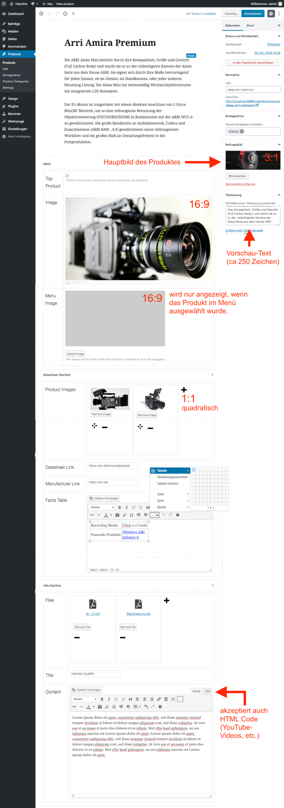
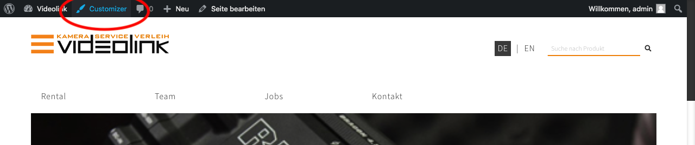
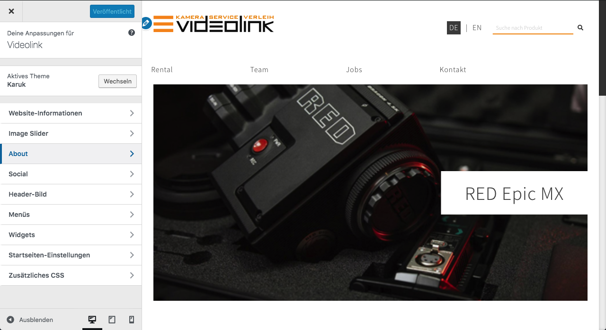
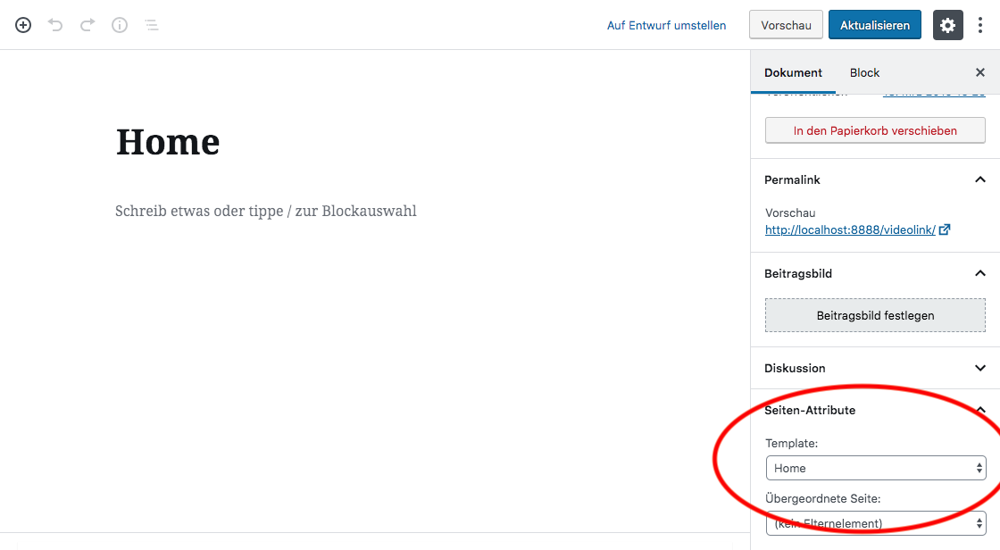
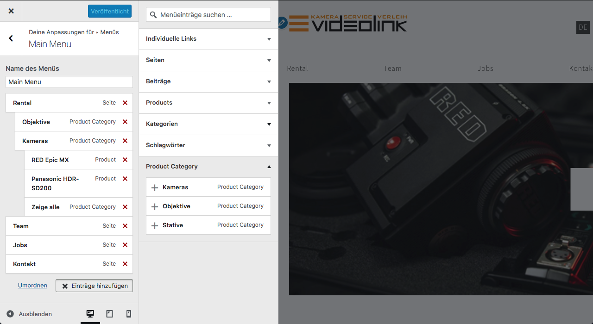

# Videolink WordPress Produkte Plugin
## Installieren
Um das Plugin zu nutzen, reicht es aus, den kompletten Ordner in das Verzeichnis /wp-content/plugins zu kopieren und anschließend in der Verwaltungsoberfläche das Plugin zu aktivieren 

## Nutzung
Nach Aktivierung des Plugins erscheint im Menü der Verwaltungsoberfläche ein neuer Reiter mit dem Titel „Products“. Alle folgenden Beschreibungen beziehen sich auf die Untermenüpunkte in diesem Abschnitt.

### Produkte einpflegen
Um ein neues Produkt anzulegen entweder direkt „Add“ in der Seitenspalte wählen oder in der Produktübersicht die Schaltflächen „Erstellen“ drücken. 
Auf der jetzt erschienenen Seite können alle das Produkt betreffenden Informationen und Bilder hochgeladen werden. 

### Produkte einer Produktkategorie zuweisen
In der Produktübersicht der Verwaltungsoberfläche können über die Schaltfläche „QuickEdit“ eine oder mehrere Kategorien für das jeweilige Produkt ausgewählt werden. 
Die Menüposition bleibt hiervon unberührt.

### WordPress Customizer
Der WordPress Customizer ist eine einfache Möglichkeit Einstellungen am Design (Logo, Inhalt der Home-Seite, Menü-Struktur) direkt im FrontEnd vorzunehmen. 
Erreichbar ist er über die Admin-Bar (Achtung! Nur sichtbar, wenn man sich in der Verwaltungsoberfläche eingeloggt hat).

#### Homepage gestalten
Die Home-Seite ist im Prinzip auch eine reguläre WordPress Seite, mit dem Unterschied, dass für diese im Backend das "Page-Template" Homepage ausgewählt wurde.

Änderungen können über den Customizer vorgenommen werden.

#### Menü erstellen
Das Navigationsmenü lässt sich ebenfalls im Customizer gestalten. Es können bis zu drei Ebenen erstellt werden. Um neue Seiten, Produkte oder Produkt-Kategorien dem Menü hinzuzufügen, können diese nach dem Klick auf Hinzufügen aus der dann erschienenen Spalte per Drag and Drop in das Menü an die entsprechende Position gezogen werden. 
